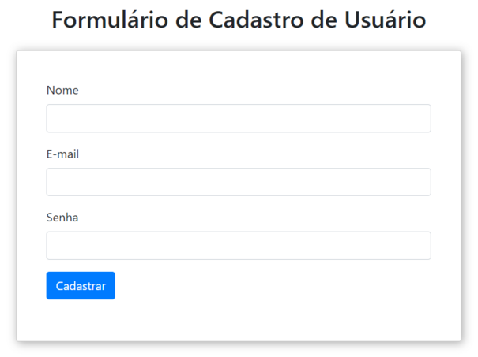
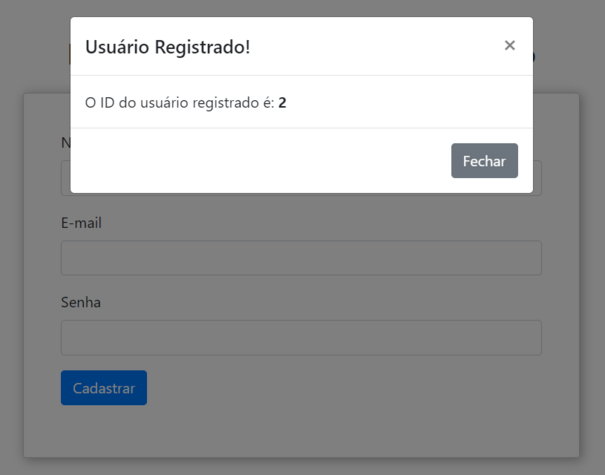
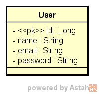

<div align="center">
  <h1><strong>4Seniors - Cadastro de Usuário</strong></h1>
</div>

## Índice

- [Índice](#índice)
- [Sobre](#sobre)
- [Arquitetura Multicamadas](#arquitetura-multicamadas)
  - [Entity](#entity)
  - [DTO (Data Transfer Object)](#dto-data-transfer-object)
  - [Repository](#repository)
  - [Controller](#controller)
  - [Service](#service)
- [Diagrama Organizacional da Entidade User](#diagrama-organizacional-da-entidade-user)
- [Spring x Modelo Tradicional](#spring-x-modelo-tradicional)
- [Diagrama de Classes](#diagrama-de-classes)
- [Tecnologias Utilizadas](#tecnologias-utilizadas)
- [Instalação e Uso](#instalação-e-uso)
- [Como Contribuir](#como-contribuir)
- [Contato](#contato)
- [Licença](#licença)
- [Status do Projeto](#status-do-projeto)

## Sobre

<div align="center">
  
</div>

Este projeto é uma aplicação Web, construída com o framework Spring, projetada especificamente para usar JSP (JavaServer Pages) como mecanismo de visualização. O foco principal da aplicação é fornecer uma plataforma eficiente para o cadastro de usuários.

Desenvolvido em resposta ao Desafio "Cadastro de Usuários" proposto pela [4Seniors](https://www.4sr.com.br/), a aplicação gira em torno do modelo de domínio **User**. Este modelo não apenas representa um usuário dentro do sistema, mas também atua como um núcleo para todas as operações relacionadas ao cadastro, integrando-se perfeitamente com as diferentes camadas da arquitetura da aplicação.

O modelo de domínio **User** básico, contém as seguintes propriedades:

```java
public class User {

    private Long id;
    private String name;
    private String email;
    private String password;

    // Constructors, Getters, Setters...
}
```

<div align="center">
  
</div>

[Voltar ao Índice](#índice)

## Arquitetura Multicamadas

A aplicação segue uma Arquitetura Multicamadas, o que proporciona uma separação de responsabilidades e facilita a manutenção, testabilidade e escalabilidade do software.

### Entity
A camada **Entity** contém as entidades do domínio da aplicação. São objetos que representam as tabelas do banco de dados e suas relações. Por exemplo, a entidade `User` representa um usuário na aplicação.

### DTO (Data Transfer Object)
**DTOs** são objetos simples usados para transferir dados entre os processos ou através das camadas da aplicação sem precisar usar as entidades diretamente. Eles são úteis para transportar informações, principalmente quando se quer enviar ou receber mais do que um campo, ou quando queremos isolar o que é enviado/recebido.

### Repository
A camada **Repository** fornece uma abstração do banco de dados. Ela é responsável por realizar operações de CRUD (Criar, Ler, Atualizar e Deletar) no banco. O Spring Data JPA torna isso muito simples e reduz a necessidade de código **boilerplate**.

### Controller
A camada **Controller** lida com a lógica de apresentação. Ela intercepta as requisições do usuário, processa-as (com a ajuda da camada de serviço) e retorna a resposta adequada, seja ela uma página JSP (**nosso caso**) ou dados em formato JSON/XML.

### Service
A camada **Service** contém a lógica de negócios da aplicação. Ela se situa entre o Controller e o Repository, assegurando que os dados estejam corretos e que regras de negócio sejam cumpridas antes de chegar ou sair do banco de dados.

[Voltar ao Índice](#índice)

## Diagrama Organizacional da Entidade User

```
+---------------+
|   Controller  |
+-------+-------+
        |
        v
+-------+-------+
|      DTO      |
+-------+-------+
        |
        v
+-------+-------+
|    Service    |
+-------+-------+
        |
        v
+-------+-------+
|   Repository  |
+-------+-------+
        |
        v
+-------+-------+
|     Entity    |
+-------+-------+
        |
        v
    Database
```

Organização em formato de árvore:

``` 
App
|
|-- controllers
|   |
|   `-- UserController
|
|-- services
|   |
|   |-- UserService (Interface)
|   `-- UserServiceImpl (Implementação da interface UserService)
|
|-- repositories
|   |
|   `-- UserRepository
|
|-- dtos
|   |
|   `-- UserDTO
|
|-- entities
|   |
|   `-- User
|
`-- config
    |
    `-- WebConfig
```

Esta representação exibe a organização dos componentes da aplicação:

- **controllers**: Responsável por gerenciar as requisições HTTP, atua como um mediador entre a camada de serviço e a camada de visualização **JSP**.
  
- **services**: Define a lógica de negócio. Tem duas partes: a interface `UserService` e sua implementação `UserServiceImpl`.
  
- **repositories**: Interage com o banco de dados. Usa o **padrão de design** ``Repository`` para abstrair o acesso ao banco de dados.
  
- **dtos**: Usado para transferir dados entre as camadas de aplicação.
  
- **entities**: Representa as entidades do banco de dados e é usada para definir a tabela e suas relações no banco de dados.

- **WebConfig**:

A classe `WebConfig` é fundamental para definir as configurações personalizadas para a camada web da aplicação. Ela é anotada com `@Configuration`, indicando que essa classe contém definições de beans do Spring que são registrados no contêiner Spring na inicialização.

A importância desse componente é que ele define a maneira como as visualizações (views/jsp) são resolvidas e localizadas dentro da aplicação. Ao fornecer uma implementação personalizada do `ViewResolver`, você está essencialmente instruindo o Spring sobre onde encontrar as visualizações e como resolvê-las.

O método `viewResolver()` é anotado com `@Bean`, indicando que ele cria um bean que pode ser gerenciado pelo contêiner Spring. A implementação específica usada aqui, `InternalResourceViewResolver`, é configurada para resolver as visualizações JSP localizadas no diretório `/WEB-INF/jsp/`. Isso significa que, quando um controlador retornar o nome de uma view, por exemplo **"index"**, o Spring procurará por um arquivo `/WEB-INF/jsp/index.jsp`.

Foi utilizado essa abordagem e a classe `WebConfig` por várias razões:

1. **Separar as configurações do código**: É sempre uma boa prática manter as configurações separadas da lógica do negócio. Assim, se precisarmos mudar a localização ou a maneira como as visualizações são resolvidas, não precisamos tocar na lógica do negócio.
   
2. **Facilidade de Manutenção**: Em projetos maiores podemos ter várias configurações personalizadas. Agrupá-los em classes de configuração dedicadas torna o projeto mais organizado.
   
3. **Flexibilidade**: Usando o `InternalResourceViewResolver`, você tem flexibilidade para definir o prefixo e o sufixo das visualizações, o que é útil quando você tem uma estrutura de diretório específica ou padrões de nomenclatura de arquivo.

4. **Integração com o Spring**: Como o Spring controla o ciclo de vida dos beans, você pode **injetar dependências**, aplicar aspectos e fazer outras operações relacionadas ao Spring em beans definidos em classes de configuração.

Resumindo, a classe `WebConfig` é um componente essencial que ajuda a organizar e personalizar as configurações da camada web da aplicação, garantindo que o Spring saiba como tratar e resolver as visualizações conforme necessário.

Usar uma estrutura como esta é vantajoso por várias razões, incluindo separação de responsabilidades, modularidade, além de facilitar a manutenção e escalabilidade do código.

[Voltar ao Índice](#índice)

## Spring x Modelo Tradicional

Optar pelo `Spring Framework`, particularmente pelo `Spring Boot`, é devido a sua capacidade de simplificar o desenvolvimento de aplicações web modernas. Aqui estão algumas razões:

1. **Configuração Zero:** O Spring Boot elimina a necessidade de um `web.xml` ao usar configuração baseada em Java. Isto reduz erros de configuração e melhora a clareza.
  
2. **Rápido e Flexível:** O Spring Boot permite criar aplicações standalone com servidores embutidos, o que facilita os processos de teste e implantação.

3. **Injeção de Dependências:** O Spring Framework é famoso por sua inversão de controle e injeção de dependências, o que torna a aplicação modular e fácil de testar.

4. **Integração com JPA:** O Spring Data JPA facilita as operações do banco de dados, eliminando muito do código boilerplate associado ao acesso a dados.

5. **Segurança:** O Spring Security fornece autenticação e autorização robustas out-of-the-box **`(OBS: aqui não foi utilizado)`**.

6. **Extensível:** A vasta gama de projetos no ecossistema Spring significa que é altamente extensível e pode ser adaptado para muitos cenários diferentes.

Em resumo, ao optar pelo Spring, estamos aproveitando uma solução moderna e robusta que acelera o desenvolvimento enquanto mantém uma alta qualidade no código.

[Voltar ao Índice](#índice)

## Diagrama de Classes

- Para entender a estrutura básica do projeto, consulte o diagrama de classes abaixo. O diagrama de classes fornece uma representação visual das classes envolvidas e suas interações, facilitando a compreensão do design do projeto.

<div align="center">
  
</div>

[Voltar ao Índice](#índice)

## Tecnologias Utilizadas

Antes de iniciar, assegure-se de ter o ambiente Java corretamente configurado em sua máquina. Abaixo você tem a relação das tecnologias que foram utilizadas no processo de desenvolvimento do projeto.

| Tecnologia                  | Versão              | Logo / Link |
| --------------------------- | ------------------- | :---------: |
| Sistema Operacional         | Windows 11          | <p align="center"><a href="https://www.microsoft.com/pt-br/windows/windows-11?r=1"></a></p> |
| Linguagem de Programação (JDK) | Java 17 LTS (Azul Zulu) | <p align="center"><a href="https://www.azul.com/downloads/?package=jdk#zulu"></a></p> |
| Framework                   | Spring Boot 3.1.2   | <p align="center"><a href="https://spring.io/projects/spring-boot"></a></p> |
| Banco de Dados              | H2 Database         | <p align="center"><a href="https://www.h2database.com/html/main.html"></a></p> |
| IDE                         | IntelliJ IDEA 2023.2 (Community Edition) | <p align="center"><a href="https://www.jetbrains.com/idea/download/other.html"></a></p> |

[Voltar ao Índice](#índice)

## Instalação e Uso

Clone o repositório do Github:

```sh
git clone git@github.com:solucaoerp/4sr.git
```

Abra o projeto `users` através de sua IDE, baixe as dependências e execute o projeto.

Para acessar o formulário de cadastro de usuário, use a rota principal da aplicação: `http://localhost:8090`

Para acessar o console **H2 Database**, digite o endereço `http://localhost:8090/h2-console` em seu navegador de internet.

- Através da imagem abaixo você encontra as credenciais de acesso. Essas informações também podem ser encontradas no perfil de `test` no diretório `resources`. 

<div align="center">
  
</div>

- Este projeto é configurado para ser executado em diferentes perfis, proporcionando flexibilidade e adaptabilidade para diferentes ambientes de desenvolvimento. Para fins de demonstração, foi utilizado o perfil **'test'**, especificamente configurado para utilizar o banco de dados em memória H2. Isso permite a criação de um ambiente de teste ágil, facilitando a validação das funcionalidades do aplicativo sem a necessidade de configuração adicional.

O perfil ativo é definido no arquivo `application.properties`:

```properties
spring.profiles.active=test
```

As configurações específicas para o perfil **'test'** são definidas no arquivo `application-test.properties`.

Com essas configurações você poderá realizar testes rapidamente e ver as consultas SQL's geradas, facilitando a identificação de possíveis problemas de desempenho ou comportamento inesperado.

[Voltar ao Índice](#índice)

## Como Contribuir

Contribuições são sempre bem-vindas! Se você tem uma sugestão que poderia melhorar este projeto, por favor, abra uma issue ou um pull request, seguindo os passos abaixo.

1. Crie um 'Fork' do projeto
2. Crie uma 'Branch' para sua modificação (`git checkout -b feature/AmazingFeature`)
3. Faça o 'Commit' das suas mudanças (`git commit -m 'Add some AmazingFeature'`)
4. 'Push' para a 'Branch' (`git push origin feature/AmazingFeature`)
5. Abra uma 'Pull Request'

[Voltar ao Índice](#índice)

## Contato

Se você tiver alguma dúvida, comentário ou sugestão, fique à vontade para abrir uma `issue` aqui no GitHub ou me contate diretamente através do e-mail: solucao.erp@gmail.com

[Voltar ao Índice](#índice)

## Licença

Este projeto está licenciado sob os termos da [Licença MIT](https://opensource.org/licenses/MIT). A Licença MIT é uma licença de software livre e de código aberto que permite o uso, a cópia, a modificação e a distribuição do código-fonte. Esta licença é notória por sua simplicidade e flexibilidade, incentivando a colaboração e a inovação no software de código aberto.

[Voltar ao Índice](#índice)

## Status do Projeto

Este README será atualizado conforme o projeto evolui. Fique ligado para novas funcionalidades e melhorias!

[Voltar ao Índice](#índice)